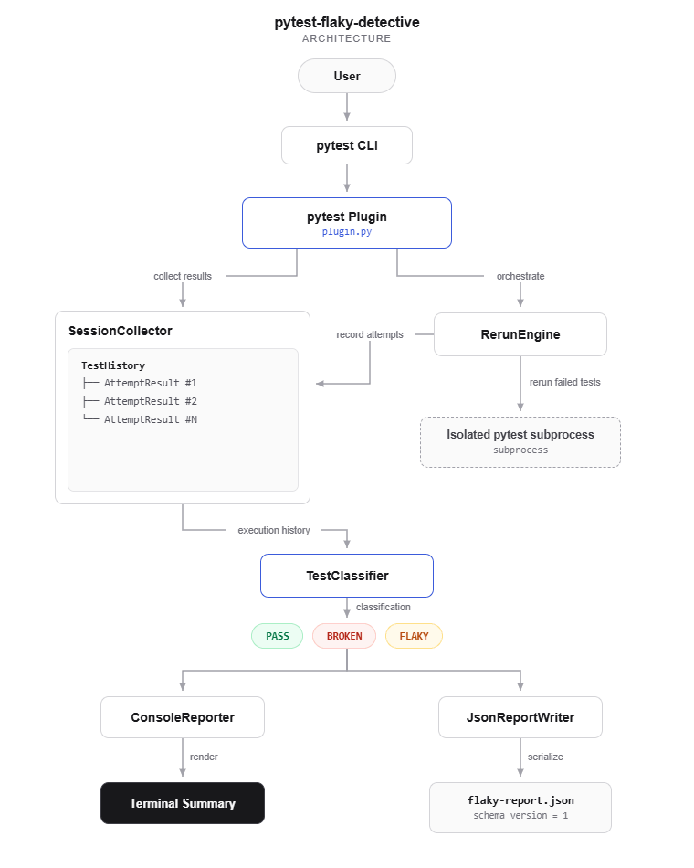

# pytest-flaky-detective

A pytest plugin that **measures test reliability instead of masking failures**.

Unlike retry plugins that immediately rerun failed tests to make builds pass, `pytest-flaky-detective` preserves the original execution, performs controlled reruns in isolated subprocesses, classifies failures as **PASS**, **BROKEN**, or **FLAKY**, and generates a CI-consumable JSON report.

---

## Features

- Detects flaky tests through controlled reruns
- Distinguishes flaky failures from consistently broken tests
- Executes reruns in isolated pytest subprocesses
- Preserves complete execution history
- Generates versioned JSON reports for CI pipelines

---

# Architecture

<p align="center">
  
</p>

---

# How is this different from pytest-rerunfailures?

| pytest-rerunfailures | pytest-flaky-detective |
|-----------------------|------------------------|
| Retries immediately after failure | Completes the initial test run before rerunning failures |
| Designed to reduce CI failures | Designed to measure test reliability |
| Reports the final execution result | Preserves the complete execution history |
| May hide intermittent failures | Explicitly identifies flaky tests |

---

# Classification Algorithm

```text
Initial Run

PASS
    ↓
PASS

FAIL
    ↓
Any rerun passed?
       │
   ┌───┴────┐
   │        │
  Yes       No
   │         │
FLAKY     BROKEN
```

---

# Rerun Strategy

```text
Run entire test suite
        │
        ▼
Capture initial failures
        │
        ▼
Rerun only failed tests
(in isolated pytest subprocesses)
        │
        ▼
Append execution history
        │
        ▼
Classify results
        │
        ▼
Generate:
 • Console Summary
 • JSON Report
```

---

# Example

```bash
pytest --flaky-runs=3 --flaky-report=flaky-report.json
```

Example output

```text
PASS     : 12
BROKEN   : 2
FLAKY    : 3
```

---

# JSON Report

```json
{
  "schema_version": 1,
  "summary": {
    "pass": 12,
    "broken": 2,
    "flaky": 3
  },
  "tests": [
    {
      "nodeid": "tests/test_login.py::test_login",
      "classification": "FLAKY",
      "attempts": [
        {
          "attempt": 1,
          "outcome": "failed"
        },
        {
          "attempt": 2,
          "outcome": "passed"
        }
      ]
    }
  ]
}
```

---

# Tech Stack

- Python
- Pytest Plugin API
- Dataclasses
- Subprocess
- Ruff
- Mypy
- GitHub Actions (CI)

---

# Future Improvements

- Parallel reruns
- HTML report generation
- Configurable classification policies
- Historical trend analysis